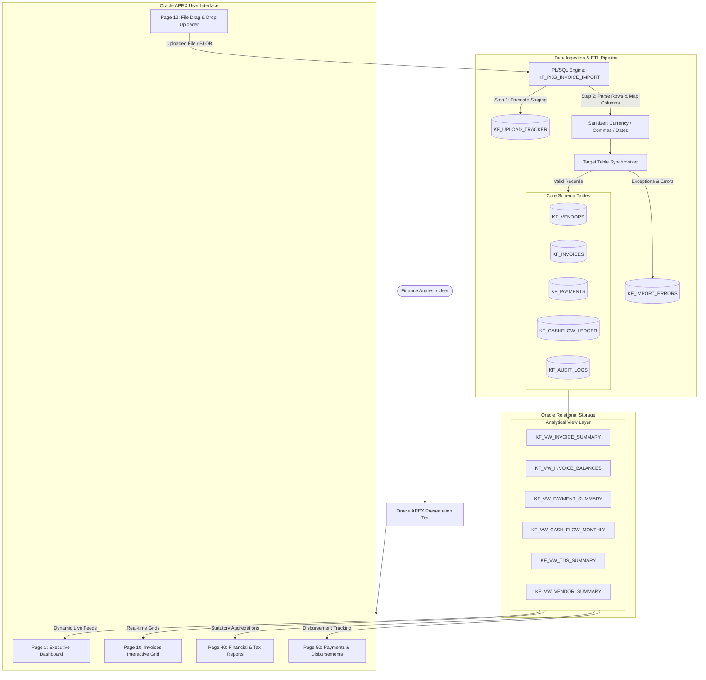

# Kovaion Finance

Kovaion Finance is an enterprise-grade financial operations, invoice reconciliation, and multi-currency accounting platform engineered on Oracle APEX and Oracle Autonomous Database. The platform automates invoice ingestion across heterogeneous spreadsheet formats (standard CSV and multi-column Excel trackers), synchronizes vendor ledgers, computes real-time tax and payment balances, and provides executive dashboards with drill-down analytics.

---

## Table of Contents

1. [Executive Summary](#executive-summary)
2. [System Architecture and Design](#system-architecture-and-design)
   - [Architectural Overview](#architectural-overview)
   - [Data Ingestion and ETL Pipeline](#data-ingestion-and-etl-pipeline)
   - [Analytical View Layer](#analytical-view-layer)
   - [Security and Audit Framework](#security-and-audit-framework)
3. [Database Schema and Data Model](#database-schema-and-data-model)
   - [Entity Relationship Details](#entity-relationship-details)
   - [Core Table Specifications](#core-table-specifications)
4. [Project Structure and File Manifest](#project-structure-and-file-manifest)
   - [Directory Layout](#directory-layout)
   - [Detailed Component Manifest](#detailed-component-manifest)
5. [Application Modules and User Interface](#application-modules-and-user-interface)
6. [Deployment and Installation Guide](#deployment-and-installation-guide)
   - [Prerequisites](#prerequisites)
   - [Database Script Execution Sequence](#database-script-execution-sequence)
   - [Oracle APEX Application Import](#oracle-apex-application-import)
   - [Verification and Smoke Testing](#verification-and-smoke-testing)
7. [Maintenance and Operational Runbook](#maintenance-and-operational-runbook)

---

## Executive Summary

Corporate finance teams frequently encounter disparate invoicing formats from multiple operating units and vendors. Manual consolidation introduces latency, data truncation, and reconciliation errors. Kovaion Finance resolves these challenges by providing:

- A unified file parser capable of auto-detecting column layouts from either 7-column operational CSVs or 26-column enterprise Excel workbooks.
- Automatic data normalization, stripping formatting symbols and sanitizing messy financial amounts.
- Complete idempotency during imports via automated staging purge mechanisms.
- Real-time statutory tracking for GST, TDS deductions, and outstanding payable aging.
- Interactive Universal Theme dashboards displaying live key performance indicators, cash flow breakdowns, and vendor distribution.

---

## System Architecture and Design

### Architectural Overview

Kovaion Finance implements a decoupled, three-tier architecture:

1. **Presentation Tier (Oracle APEX Universal Theme):**
   - High-density responsive web pages (Pages 1, 10, 11, 12, 40, 50, 51, 9999).
   - Component-level dynamic PL/SQL regions rendering customized HTML5/CSS visualizations and progress bars without external JavaScript dependencies.
   - Interactive Grids and modal dialogs with declarative validation and session state management.

2. **Business Logic and Processing Tier (PL/SQL Engine):**
   - Package `KF_PKG_INVOICE_IMPORT` coordinates file extraction, schema discovery, data type casting, error routing, and target synchronization.
   - Dedicated update scripts (`update_page1_dashboard.sql`, `update_page40_reports.sql`, `update_page50_payments.sql`) provide live querying against database views.

3. **Data and Persistence Tier (Oracle Database):**
   - Relational tables enforcing primary keys, foreign keys, check constraints, identity columns, and default timestamps.
   - Performance-tuned views abstracting complex joins and aggregations.
   - Automated audit logging capturing database user, timestamps, and row-level operations.



### Data Ingestion and ETL Pipeline

The file ingestion subsystem handles variability across source files through four distinct stages:

1. **Pre-Ingestion Purge:** Prior to processing an incoming spreadsheet, `KF_PKG_INVOICE_IMPORT` automatically clears the intermediate staging table `KF_UPLOAD_TRACKER`. This ensures idempotency: re-uploading a corrected file completely refreshes the data set without residual duplicate rows.
2. **Dynamic Header Resolution:** The parser examines header row metadata to resolve column indexes dynamically. Column order variations between 7-column CSVs (produced by front-office systems) and 26-column Excel files (produced by corporate ERP tracking) are mapped automatically to standard attributes (Invoice Number, Vendor Name, Taxable Amount, GST, Total, Due Date, and TDS Section).
3. **Data Sanitization and Type Casting:**
   - Currency identifiers (`INR`, `USD`, `GBP`, `₹`, `$`) and formatting delimiters (commas, leading/trailing whitespace) are stripped using regular expression patterns.
   - Dates in formats such as `DD-MM-YYYY`, `YYYY-MM-DD`, and standard Excel serial numbers are standardized to Oracle `DATE` types.
   - Numeric quantities are converted using defensive `TO_NUMBER` logic with `DEFAULT ON CONVERSION ERROR` safeguards to prevent runtime process termination.
4. **Target Entity Synchronization:**
   - **Vendors:** Automatically upserted into `KF_VENDORS` if the vendor name does not already exist.
   - **Invoices:** Inserted into `KF_INVOICES` with reference to the resolved `VENDOR_ID`.
   - **Exception Log:** Any malformed records that fail business rules are recorded in `KF_IMPORT_ERRORS` along with line numbers and error diagnostics.

### Analytical View Layer

To decouple database write operations from high-concurrency read operations, all dashboard components, interactive grids, and reporting widgets query compiled database views:

- `KF_VW_INVOICE_SUMMARY`: Flattens vendor, invoice, and currency attributes into a reporting structure.
- `KF_VW_INVOICE_BALANCES`: Evaluates cumulative payments against invoice totals to compute real-time balances and dynamically assign status flags (`PAID`, `PARTIALLY_PAID`, `UNPAID`).
- `KF_VW_PAYMENT_SUMMARY`: Joins payment transactions with vendor and invoice details for disbursement auditing.
- `KF_VW_CASH_FLOW_MONTHLY`: Aggregates cash inflows, outflows, and net positions grouped by calendar month.
- `KF_VW_TDS_SUMMARY`: Aggregates statutory tax withholdings grouped by applicable TDS sections (e.g., 194C, 194J).
- `KF_VW_VENDOR_SUMMARY`: Computes vendor spend metrics, transaction counts, and concentration ratios.

### Security and Audit Framework

- **Audit Logs (`KF_AUDIT_LOGS`):** Captures user identity, operation timestamp, action type (`INSERT`, `UPDATE`, `DELETE`), and target entity details.
- **Session State Isolation:** Oracle APEX session tokens and item protections prevent cross-site request forgery and unauthorized URL parameter tampering.
- **Authentication:** Dedicated authentication scheme configured in `shared-components/authentications.apx` with custom login branding on Page 9999.

---

## Database Schema and Data Model

### Entity Relationship Details

```text
+------------------+         1:N         +------------------+
|    KF_VENDORS    | -------------------< |   KF_INVOICES    |
+------------------+                     +------------------+
        |                                         |
        | 1:N                                     | 1:N
        v                                         v
+------------------+                     +------------------+
|   KF_PAYMENTS    | >-------------------|   KF_PAYMENTS    |
+------------------+                     +------------------+
        |
        v
+------------------------+
|   KF_CASHFLOW_LEDGER   |
+------------------------+
```

### Core Table Specifications

1. **`KF_VENDORS`**: Master vendor directory.
   - `VENDOR_ID` (NUMBER, Identity, PK)
   - `VENDOR_NAME` (VARCHAR2(150), Unique, Not Null)
   - `PAN` (VARCHAR2(20))
   - `STATE` (VARCHAR2(50))
   - `GSTIN` (VARCHAR2(20))

2. **`KF_INVOICES`**: Primary invoice transactions.
   - `INVOICE_ID` (NUMBER, Identity, PK)
   - `INVOICE_NUMBER` (VARCHAR2(50), Not Null)
   - `VENDOR_ID` (NUMBER, FK referencing `KF_VENDORS`)
   - `INVOICE_DATE` (DATE)
   - `DUE_DATE` (DATE)
   - `INVOICE_PERIOD` (VARCHAR2(20))
   - `NATURE_OF_EXPENSE` (VARCHAR2(100))
   - `TAXABLE_VALUE` (NUMBER)
   - `GST_AMOUNT` (NUMBER)
   - `TOTAL_AMOUNT` (NUMBER)
   - `TDS_SECTION` (VARCHAR2(20))
   - `TDS_RATE` (NUMBER)
   - `STATUS` (VARCHAR2(30), Default 'Pending')
   - `SECTION_NAME` (VARCHAR2(50))
   - `CREATED_AT` (TIMESTAMP, Default SYSTIMESTAMP)

3. **`KF_PAYMENTS`**: Recorded disbursements.
   - `PAYMENT_ID` (NUMBER, Identity, PK)
   - `INVOICE_ID` (NUMBER, FK referencing `KF_INVOICES`)
   - `VENDOR_ID` (NUMBER, FK referencing `KF_VENDORS`)
   - `PAYMENT_DATE` (DATE)
   - `PAYMENT_AMOUNT` (NUMBER)
   - `PAYMENT_METHOD` (VARCHAR2(50))
   - `REFERENCE_NUMBER` (VARCHAR2(100))
   - `STATUS` (VARCHAR2(30), Default 'COMPLETED')
   - `CREATED_BY` (VARCHAR2(100))

4. **`KF_UPLOAD_TRACKER`**: Intermediate staging table for parsed file records.
5. **`KF_IMPORT_ERRORS`**: Execution log capturing parsing failures and rejected rows.
6. **`KF_CASHFLOW_LEDGER`**: General ledger entries for cash and bank operations.
7. **`KF_AUDIT_LOGS`**: Historical audit record for user transactions.

---

## Project Structure and File Manifest

### Directory Layout

```text
Kovaion_Finance/
├── .apex/
│   └── apexlang.json
├── pages/
│   ├── p00001-home.apx
│   ├── p00010-invoices.apx
│   ├── p00011-invoice-form.apx
│   ├── p00012-import-invoices.apx
│   ├── p00040-reports.apx
│   ├── p00050-payments.apx
│   ├── p00051-create-payment.apx
│   └── p09999-login.apx
├── shared-components/
│   ├── authentications.apx
│   ├── authorizations.apx
│   ├── app-items.apx
│   ├── app-processes.apx
│   ├── lists.apx
│   ├── lovs.apx
│   ├── static-files.apx
│   ├── static-files/
│   │   ├── app-112618-logo.jpg
│   │   └── icons/
│   │       ├── app-icon-32.png
│   │       ├── app-icon-144-rounded.png
│   │       └── app-icon-192.png
│   └── themes/
│       └── universal-theme/
│           └── theme.apx
├── .gitignore
├── application.apx
├── page-groups.apx
├── master_schema.sql
├── kf_schema_phase4.sql
├── step1_package_spec.sql
├── step2_final_fix.sql
├── populate_payments.sql
├── update_page1_dashboard.sql
├── update_page40_reports.sql
├── update_page50_payments.sql
├── Kovaion_Finance_APEX_APP47919.zip
└── README.md
```

### Detailed Component Manifest

| Component Path | Type | Function and Purpose |
| :--- | :--- | :--- |
| `Kovaion_Finance_APEX_APP47919.zip` | Archive | Standalone, official APEX application export archive (App ID: 47919) ready for direct workspace import. |
| `application.apx` | APEX Definition | Main application configuration, global security settings, and environment identifiers. |
| `page-groups.apx` | APEX Definition | Organizational page grouping metadata for navigation and permissions. |
| `.apex/apexlang.json` | Configuration | Metadata defining Oracle APEX internal language and version compatibility tokens. |
| `pages/p00001-home.apx` | APEX Page | Source definition for Page 1 (Executive Dashboard). |
| `pages/p00010-invoices.apx` | APEX Page | Source definition for Page 10 (Invoices Register Interactive Grid). |
| `pages/p00011-invoice-form.apx` | APEX Page | Source definition for Page 11 (Invoice Edit / Create Modal Form). |
| `pages/p00012-import-invoices.apx`| APEX Page | Source definition for Page 12 (File Upload and Ingestion Wizard). |
| `pages/p00040-reports.apx` | APEX Page | Source definition for Page 40 (Financial Reports & Analytics). |
| `pages/p00050-payments.apx` | APEX Page | Source definition for Page 50 (Disbursements and Payment Flows). |
| `pages/p00051-create-payment.apx`| APEX Page | Source definition for Page 51 (Record Payment Modal Dialog). |
| `pages/p09999-login.apx` | APEX Page | Source definition for Page 9999 (Universal Theme Authentication). |
| `shared-components/` | Shared Elements | Reusable application infrastructure: LOVs, navigation lists, security schemes, and branding icons. |
| `master_schema.sql` | SQL DDL | Schema initialization script creating primary database tables, primary/foreign keys, and constraints. |
| `kf_schema_phase4.sql` | SQL DDL | Creates all business views (`KF_VW_*`) and analytic calculation layers. |
| `step1_package_spec.sql` | PL/SQL Spec | Declares the public interface for the file ingestion package `KF_PKG_INVOICE_IMPORT`. |
| `step2_final_fix.sql` | PL/SQL Body | Implements the universal CSV and Excel parser, sanitization rules, and target synchronization logic. |
| `populate_payments.sql` | SQL DML | Reconciles and populates `KF_PAYMENTS` from paid invoices. |
| `update_page1_dashboard.sql` | PL/SQL Script | Deploys the dynamic executive dashboard with interactive tabbed widgets and live metric calculations. |
| `update_page40_reports.sql` | PL/SQL Script | Configures Page 40 reporting regions with live view integrations. |
| `update_page50_payments.sql` | PL/SQL Script | Configures Page 50 payments register with live view integrations. |
| `.gitignore` | Git Config | Excludes operating system artifacts, temporary dumps, and build caches. |

---

## Application Modules and User Interface

### Page 1: Executive Dashboard
- **Metric Cards:** Displays aggregated totals for Total Invoices, Total Invoiced Value, GST Collected, Total Paid, and Outstanding Balance directly calculated from `KF_INVOICES` and `KF_PAYMENTS`.
- **Interactive Tabs:** Segmented views for Overview, Vendor Analysis, Cashflow Trends, and Recent Invoices.
- **Live Visualizations:** Custom CSS bar charts displaying vendor spend concentration and invoice status distribution.

### Page 10: Invoices Interactive Grid
- Multi-column interactive grid enabling filtering, sorting, column hiding, aggregations, and export to Excel/PDF.
- Status badges indicating operational state (`Paid`, `Pending`, `Overdue`).

### Page 12: Ingestion Engine Interface
- Drag-and-drop file upload zone accepting `.csv` and `.xlsx` formats.
- Instant execution hook calling `KF_PKG_INVOICE_IMPORT.PROCESS_UPLOADED_FILE`.
- On-screen summary of processed rows, skipped rows, and validation exceptions.

### Page 40: Financial & Statutory Reports
- Real-time balances and aging analysis derived from `KF_VW_INVOICE_BALANCES`.
- Statutory TDS reporting organized by tax section for quarterly reconciliation.
- Monthly cashflow inflows versus outflows.

### Page 50: Payments & Disbursements
- Consolidated register tracking payment dates, payment modes (Bank Transfer, Cheque, NEFT), transaction references, and settlement statuses.
- Modal launcher linking directly to Page 51 for recording new disbursements against outstanding balances.

---

## Deployment and Installation Guide

### Prerequisites
- Oracle Database 19c or higher (or Oracle Autonomous Database).
- Oracle APEX 22.2 or higher.
- A target workspace with schema provisioning permissions (e.g., `WKSP_GOWSIK`).

### Database Script Execution Sequence

Open **SQL Workshop** > **SQL Scripts** (or execute via SQL Developer / SQLcl connected as the workspace parsing schema) in the following order:

```text
Step 1: master_schema.sql
        Creates tables, sequences, identity columns, and audit structures.

Step 2: kf_schema_phase4.sql
        Compiles the analytical views (KF_VW_INVOICE_SUMMARY, KF_VW_INVOICE_BALANCES, etc.).

Step 3: step1_package_spec.sql
        Compiles the package specification for KF_PKG_INVOICE_IMPORT.

Step 4: step2_final_fix.sql
        Compiles the universal package body for CSV/Excel ingestion.

Step 5: populate_payments.sql (Optional)
        Syncs initial payment records for any pre-existing invoice data.
```

### Oracle APEX Application Import

1. Access your Oracle APEX Workspace.
2. Navigate to **App Builder** > **Import**.
3. Drag and drop `Kovaion_Finance_APEX_APP47919.zip`.
4. Leave File Type set to **Database Application, Page or Component Export**.
5. Click **Next** and proceed through the installation wizard.
6. Verify or assign an Application ID (e.g., `47919` or an available ID in your environment).
7. If customizing individual page queries, run `update_page1_dashboard.sql`, `update_page40_reports.sql`, and `update_page50_payments.sql` in **SQL Commands**.

### Verification and Smoke Testing

1. **Authentication Test:** Log in via Page 9999 using workspace credentials.
2. **File Ingestion Test:** Navigate to Page 12, upload a sample tracker file, and confirm success messages in the notification area.
3. **Ledger Verification:** Verify that `KF_INVOICES` and `KF_VENDORS` show updated row counts:
   ```sql
   SELECT COUNT(*) AS invoice_count FROM KF_INVOICES;
   SELECT COUNT(*) AS vendor_count  FROM KF_VENDORS;
   ```
4. **Dashboard Verification:** Navigate to Page 1 and ensure all KPI cards render live non-zero figures and tab navigation toggles smoothly.
5. **Report Validation:** Navigate to Page 40 and ensure `KF_VW_INVOICE_BALANCES` renders without errors.

---

## Maintenance and Operational Runbook

### Handling Ingestion Exceptions
When users encounter row validation warnings, query the error log:
```sql
SELECT 
    ERROR_ID, 
    FILE_NAME, 
    LINE_NUMBER, 
    ERROR_MESSAGE, 
    CREATED_AT 
FROM KF_IMPORT_ERRORS 
ORDER BY CREATED_AT DESC;
```

### Refreshing Ingestion Packages
If business requirements introduce new spreadsheet column headers, add the alias names into the mapping array in `step2_final_fix.sql` and recompile:
```sql
ALTER PACKAGE KF_PKG_INVOICE_IMPORT COMPILE BODY;
```

### Purging Staging and Error Logs
To truncate historical upload staging and audit history older than 90 days:
```sql
DELETE FROM KF_IMPORT_ERRORS WHERE CREATED_AT < SYSTIMESTAMP - INTERVAL '90' DAY;
DELETE FROM KF_AUDIT_LOGS WHERE ACTION_TIMESTAMP < SYSTIMESTAMP - INTERVAL '90' DAY;
COMMIT;
```

---

## License

Internal enterprise financial software developed for Kovaion. All rights reserved.
